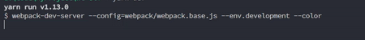

# webpack-progress-bar


# 安装 install
```
npm i webpack-progress-bar-plugin -D 
yarn add webpack-progress-bar-plugin -D
```

# 使用 use
``` js
const WebpackProgressBar = require('webpack-progress-bar')

plugins: [
  new WebpackProgressBar()
]

```

# 选项 options
``` js
// default options
new WebpackProgressBar({
  incomplete: {      
    // 'black', 'red', 'green', 'yellow', 'blue', 'magenta', 'cyan', 'white'
    // '黑色'，'红色'，'绿色'，'黄色'，'蓝色'，'品红'，'青色'，'白色' 
    bg: 'white',
    content: ' '
  },
  complete: {
    bg: 'green',
    content: ' '
  },
  width: 25, // Control progress bar width. 控制进度条宽度
  clear: true, // Clear the progress bar after compilation is complete.编译完成后清除进度条。
  total: 100 
})

```

